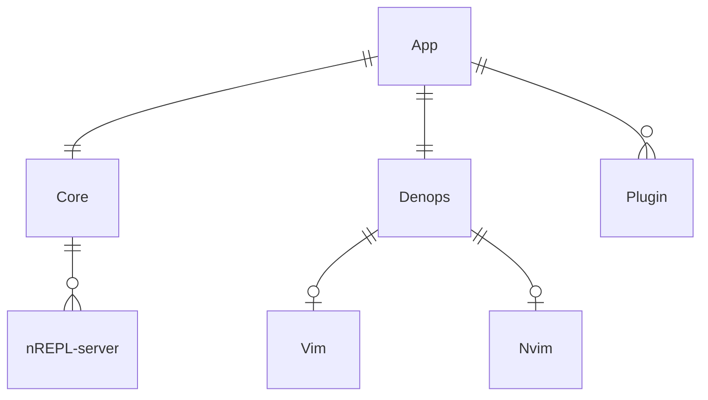

# icedon app

## module relations

```mermaid
erDiagram
    App ||--|| Core : ""
    Core ||--o{ nREPL-server : ""
    App ||--|| Denops : ""
    Denops ||--o| Vim : ""
    Denops ||--o| Nvim : ""
    App ||--o{ Plugin : ""
```

